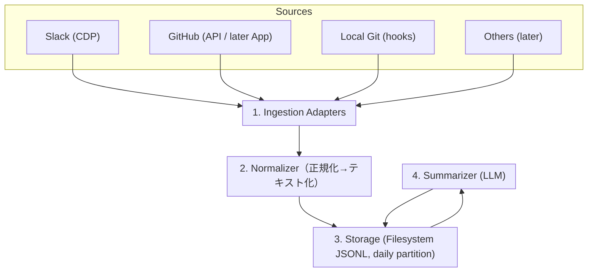

# ReacLog 仕様書 v0.1（マルチソース作業ログ基盤）

> 目的：Slack の投稿/リアクションに加え、GitHub（クラウド）やローカル Git（Linux 等）の変更・コメント・差分を**軽量に収集**し、**日次の作業ログ**を LLM で自動要約する。

---

## 0. スコープ & 非スコープ

- **スコープ**：
  - Slack（CDP経由）での `chat.postMessage` / `reactions.add|remove` の収集
  - GitHub イベント（PR/Issue/コメント/レビュー等）の収集（最小はポーリング）
  - ローカル Git フック（commit/push/merge）の収集
  - 共通イベントへの正規化、SQLite 保存、FTS 検索
  - **JST基準の日次サマリ**（Markdown）の生成

- **非スコープ（v0.1）**：
  - チーム全体の統合監査（個人用途に限定）
  - 完全なPIIマスキング・高度な権限統制（将来版で検討）
  - GitHub App + Webhook の本格運用（v0.2以降）

---

## 1. 全体アーキテクチャ



**設計原則**

- 収集は**薄いアダプタ**に閉じる（環境依存を局所化）。
- 保存は **日付×ソースの JSONL 追記**でシンプル運用（SQL 依存なし）。
- LLM には **Markdown レコード（MD‑Record v1）**を渡す（本文は常にコードフェンス）。

---

## 2. データモデル（Filesystem / JSONL + Markdown）

### 2.1 保存ディレクトリ構成（例）

```
<dataDir>/
  2025/
    11/
      03/
        slack/
          events.jsonl       # 1行=1 JSON レコード（正規化イベント）
          ingest.log         # 任意の収集ログ
        github/
          events.jsonl
        git-local/
          events.jsonl
        summaries/
          daily.md           # その日の最終 Markdown サマリ
```

- 追記専用（append-only）。ファイルロックで多重書き込みを抑止。
- ディレクトリの日付は **イベント記録時刻 (`logged_at`)** に基づく。すべてのレコードで `logged_at` を必須とし、ISO8601 の文字列で格納する。
- ローテーションは日付ディレクトリ単位。

### 2.2 JSONL レコード仕様（NormalizedEvent v1.1：共通＋ネスト詳細）

**目的**：どのイベントにも共通な最小コアをフラットに配置し、ソース固有の項目は `detail` にネスト保持する。

```json
{
  "schema": "reaclog.event.v1.1",
  "uid": "slack:C08QLKYPUUW@1762150061.xxxx10",
  "source": "slack", // "slack" | "github" | "git-local" | ...
  "kind": "post", // 共通の論理種別
  "action": null, // 任意
  "actor": "山崎", // 任意
  "subject": "テストメッセージ", // 任意（見出し）
  "ts": "2025-11-03T15:07:41+09:00", // イベント時刻（ISO8601）
  "logged_at": "2025-11-03T15:07:42+09:00", // 取り込み時刻

  "detail": {
    // ソース固有の生/準生データ（ネスト）
    "slack": {
      "channel_id": "C08QLKYPUUW",
      "channel_name": "dev-infra",
      "text": "テストメッセージ",
      "blocks": null,
      "thread_ts": "1762150053.xxxxx9"
    }
  },

  "meta": {
    // 付帯情報（共通）
    "url": null,
    "truncated": false
  }
}
```

- `detail` のキーは **source 名**（例：`slack`/`github`/`git_local`）。
- `detail.<source>` の型は**下記 3.1 のネスト型**に準拠。未使用キーは省略可。
- コア側の `subject/text/diff/repo/channel/refs` は**任意**。必要なら `detail` から計算して後段でレンダリング。

#### 例：Slack reaction

```json
{
  "schema": "reaclog.event.v1.1",
  "uid": "slack:C08QLKYPUUW@1762149560.712159:eyes:added:U123",
  "source": "slack",
  "kind": "reaction",
  "action": "added",
  "actor": "山崎",
  "ts": "2025-11-03T15:07:55+09:00",
  "logged_at": "2025-11-03T15:07:56+09:00",
  "detail": {
    "slack": {
      "channel_id": "C08QLKYPUUW",
      "channel_name": "dev-infra",
      "message_ts": "1762149560.712159",
      "emoji": "eyes",
      "user": "U123",
      "message_text": "例: こんにちは"
    }
  }
}
```

- UID は `channel@message_ts:emoji:action:user_id` 形式とし、同じ投稿に対して別ユーザーが add/remove を繰り返しても重複除外されないようにする。

#### 例：GitHub PR

```json
{
  "schema": "reaclog.event.v1.1",
  "uid": "gh:you/repo#PR#123",
  "source": "github",
  "kind": "pr",
  "action": "opened",
  "actor": "octocat",
  "ts": "2025-11-03T04:10:22Z",
  "subject": "Add CDP logging and multipart parsing",
  "detail": {
    "github": {
      "repo": "you/repo",
      "number": 123,
      "title": "Add CDP logging and multipart parsing",
      "state": "open",
      "head": "feat/cdp-logging",
      "base": "main",
      "html_url": "https://github.com/you/repo/pull/123"
    }
  },
  "meta": { "url": "https://github.com/you/repo/pull/123" }
}
```

#### 例：Local Git commit

```json
{
  "schema": "reaclog.event.v1.1",
  "uid": "git:/home/you/repo#commit#abc123",
  "source": "git-local",
  "kind": "commit",
  "actor": "you",
  "ts": "2025-11-03T10:21:00+09:00",
  "subject": "feat: add multipart parser",
  "detail": {
    "git_local": {
      "repo_path": "/home/you/repo",
      "sha": "abc123",
      "branch": "main",
      "files": ["src/index.ts"],
      "patch": "+ add parseMultipart()
- TODO: handle binary parts
"
    }
  }
}
```

> 保存はこれまで通り `YYYY/MM/DD/<source>/events.jsonl` への**追記**。後段のレンダラが JSONL → MD‑Record v1 を生成する。

### 2.3 LLM 投入用テキスト（MD‑Record v1）

- **目的**：JSONL を LLM が読みやすい Markdown に一時レンダリング。
- **レコード区切り**：単独行の `---`
- **ヘッダ行（1行）**：
  `## [source=slack] kind=post uid=<uid> ts=<ISO8601>`
- **メタ行（任意・最大5行）**：`actor: ...` / `channel: ...` / `repo: ...` / `action: ...` / `refs: ...`
- **サブセクション**：`### text` / `### comment` / `### diff` / `### reactions` / `### links`
- **本文は必ずコードフェンス**。フェンスは **動的長**（中身のバッククォート最大長+1）または **~ フェンス**。

例（Slack: post）

````
## [source=slack] kind=post uid=slack:C08...@1762... ts=2025-11-03T15:07:41+09:00
actor: 山崎
channel: #dev-infra

### text
```text
テストメッセージ
````

---

```

例（Git: commit + diff）
```

## [source=git-local] kind=commit uid=git:/path#commit#abc123 ts=2025-11-03T10:21:00+09:00

actor: you
repo: /home/you/repo
refs: sha=abc123

### text

```text
feat: add multipart parser
```

### diff

```diff
+ add parseMultipart()
- TODO: handle binary parts
```

---

```

### 2.4 検索/集約
- 当面は `ripgrep/grep` + `jq` + `awk` で十分。
- 日次サマリ生成時にメモリ上で UID 去重・ソートを実施。

---
- **目的**：JSONL を LLM が読みやすい Markdown に**一時レンダリング**。
- **レコード区切り**：単独行の `---`
- **ヘッダ行（1行）**：
  `## [source=slack] kind=post uid=<uid> ts=<ISO8601>`
- **メタ行（任意・最大5行）**：`actor: ...` / `channel: ...` / `repo: ...` / `action: ...` / `refs: ...`
- **サブセクション**：`### text` / `### comment` / `### diff` / `### reactions` / `### links`
- **本文は必ずコードフェンス**。フェンスは **動的長**（中身のバッククォート最大長+1）または **~ フェンス**。

例（Slack: post）
```

## [source=slack] kind=post uid=slack:C08...@1762... ts=2025-11-03T15:07:41+09:00

actor: 山崎
channel: #dev-infra

### text

```text
テストメッセージ
```

---

```

例（Git: commit + diff）
```

## [source=git-local] kind=commit uid=git:/path#commit#abc123 ts=2025-11-03T10:21:00+09:00

actor: you
repo: /home/you/repo
refs: sha=abc123

### text

```text
feat: add multipart parser
```

### diff

```diff
+ add parseMultipart()
- TODO: handle binary parts
```

---

````

### 2.4 検索/集約
- 当面は `ripgrep/grep` + `jq` + `awk` で十分。
- 日次サマリ生成時にメモリ上で UID 去重・ソートを実施。

---

## 3. 収集アダプタ（Adapters）

### 3.1 共通 IF（コア＋ネスト詳細）

```ts
export type EventCore = {
  schema: 'reaclog.event.v1.1';
  uid: string;                 // 一意キー（再生成可能）
  source: 'slack'|'github'|'git-local';
  kind: string;                // post|reaction|commit|pr|review|issue|comment|...
  action?: string;             // opened|merged|added|removed|...
  actor?: string;
  subject?: string;            // 見出し（任意）
  ts: string;                  // ISO8601（JST推奨）
  logged_at?: string;          // 取り込み時刻
  meta?: Record<string, unknown>;
};

export type SlackDetail =
  | { channel_id: string; channel_name?: string; text?: string; blocks?: unknown; thread_ts?: string }
  | { message_ts: string; channel_id: string; channel_name?: string; emoji?: string }; // reaction 系

export type GithubDetail = {
  repo: string; number?: number; title?: string; state?: string;
  head?: string; base?: string; html_url?: string;
};

export type GitLocalDetail = {
  repo_path: string; sha: string; branch?: string; files?: string[]; patch?: string;
};

export type EventDetail =
  | { slack: SlackDetail }
  | { github: GithubDetail }
  | { git_local: GitLocalDetail };

export type NormalizedEvent = EventCore & { detail?: EventDetail };

export interface IngestionAdapter {
  name: string;
  start(emit: (ev: NormalizedEvent) => Promise<void>): Promise<void>;
  stop?(): Promise<void>;
}
````

**運用上の注意**

- コアに置くのは横断集計でよく使う最小集合（`uid/source/kind/ts/actor/subject` など）。
- ソース固有の深い情報は `detail` 側に閉じ込める（型進化の影響を局所化）。
- 将来の互換性のため `schema` を明示。フィールド追加は後方互換で行う。

### 3.2 Slack（CDP）

- **取得チャネル**
  - `Fetch.requestPaused`（POST body）：`chat.postMessage` / `reactions.add|remove` の payload を正規化。
  - `Network.webSocketFrameReceived`：リッチテキストやリアルタイム編集をキャッシュ。
  - `Network.responseReceived`：一部 API 応答を補完キャッシュとして利用。
  - **DOM スナップショット**：リアクション検知直後に `Runtime.evaluate` で可視 DOM から本文を抜き出す。DOM 取得は既定で有効（`REACLOG_DISABLE_DOM_CAPTURE=1` で無効化可能）。
    - トリガー元は `/api/reactions.*` への Fetch リクエストのみ。Slack クライアントが自分のリアクションを送信する際にだけ DOM 取得が実行される。
    - WebSocket 経由で他ユーザーのリアクションを受信しても DOM キャプチャは発火しない。必要最小限のキャッシュ更新のみを行う。
- **正規化**
  - `kind='post'|'reaction'`
  - `subject`：`[#{channel}] メッセージの先頭120字` など軽量な見出し
  - `detail.slack` へ `channel_id / channel_name / text / blocks / message_ts / emoji` 等を格納
  - `uid`：`slack:{channel_id}@{message_ts}`（リアクションは `:emoji:{action}` を付与し actor でユニーク化）
- **冪等**
  - `uid` で去重
  - DOM キャプチャの成功時に得た本文をキャッシュし、同メッセージの後続リアクションでも再利用する
  - DOM キャプチャを無効化した場合は本文が空文字／`undefined` になる前提（フォールバック無し）

### 3.3 GitHub（最小：Polling / 将来：App+Webhook）

- **最小実装**：PAT + Octokit で `repos[]` を 5–10 分間隔でポーリング
  - PR/Issue/コメント/レビューの**最新 N 件**を取得
  - `uid` を `gh:{repo}#PR#{number}` / `#issueevent#{id}` / `#comment#{id}`

- **差分**：必要に応じて `GET /pulls/{number}/files` の `patch` をトリムして `diff` に
- **将来**：GitHub App + Webhook → 小型受信サーバ（Fastify/Express）へ

### 3.4 Local Git（hooks）

- `.git/hooks/post-commit` 等で JSON を生成し、**UNIX ドメインソケット**（Windows は Named Pipe）へ送信
- 受信側で `uid='git:{repo-path}#commit#{sha}'` として保存

---

## 4. サマライザ（LLM）

### 4.1 日次ジョブ（JST）

- **時刻**：23:55 JST（余裕枠）
- **入力**：対象日の `*/events.jsonl` を読み込み→UID 去重→時刻ソート
- **前処理**：
  - 連投のマージ（1分以内 & 同 actor）
  - bot/通知のフィルタ（channel / actor / subject パターン）
  - Slack reaction は**元メッセージへ付加**（近接マージ）

- **レンダリング**：JSONL → **MD‑Record v1** へ変換（本文は動的フェンス）
- **チャンク**：`source×(channel|repo)×(thread|PR|commit)` 単位に 2–4KB 分割
- **サブサマリ → 統合**：最終 Markdown を生成
- **保存**：`<dataDir>/YYYY/MM/DD/summaries/daily.md` へ書き出し（再生成可能）

### 4.2 出力テンプレート（Markdown）

```markdown
# ReacLog 日報 {{YYYY-MM-DD}}

## Slack

- [#channel] 要点 …

## GitHub

- owner/repo PR #123: タイトル …

## Local Git

- ~/work/reaclog: commits 3件 …

## TODO / ブロッカー

- …
```

### 4.3 プロンプト要点

- **役割**：業務日報編集者（冗長禁止 / 要点優先 / 技術語OK）
- **形式**：見出し＋箇条書き、重複排除、80字程度/行
- **機密対策**：人名/トークン/クエリは前処理でマスク

---

## 5. 実行モデル & バッチ

### 5.1 `pnpm start`（利用者向けワンコマンド）

- Slack デスクトップアプリ向け CDP 接続を確認しつつ、以下を **同時に** 起動する常駐コマンド。
  1. **Slack Ingestor**：CDP から `events.jsonl` に追記。
  2. **ブラウズ UI (SvelteKit)**：`http://localhost:4173`（デフォルト）で日次イベントを閲覧可能にする。ユーザーが即座に最新ログを確認できるよう、UI は開発者向けではなくエンドユーザー向けの情報設計（説明ラベル、検索/フィルタ）を提供。
  3. **ヘルスチェック**：CDP 接続状態を 30 秒間隔で確認し、再接続や UI 上でのバナー表示につなげる。
- `pnpm start -- --browser-port=4300 --data-dir=./data` のように、CLI オプションで UI ポートやデータディレクトリを上書き。
- 起動失敗時（CDP へ接続できない等）は UI だけを起動し、ヘルスバナーに「Slack を開いてください」を表示する仕様とする。
- トラブルシュート用途で `REACLOG_DISABLE_DOM_CAPTURE=1` を指定すると DOM キャプチャを停止できる（この場合、`message_text` は空のまま保存される想定）。

### 5.2 CLI 拡張（将来）

- `reaclog summary --day 2025-11-03`：JSONL から日次要約を生成
- `reaclog search --q "keyword"`：`rg` + `jq` で検索
- `reaclog export --day 2025-11-03 --out daily-2025-11-03.md`

### 5.3 スケジューリング

- **Windows**：タスク スケジューラ
- **Linux/macOS**：cron/systemd timer

---

---

## 6.1 デバッグ設定 / 起動例

Slack アダプタは環境変数で挙動を切り替えられる。

| 変数                          | 例                             | 説明                                                                                                                                                        |
| ----------------------------- | ------------------------------ | ----------------------------------------------------------------------------------------------------------------------------------------------------------- |
| `REACLOG_DEBUG`               | `slack:verbose,slack:domprobe` | ドメイン別デバッグログ。`slack:verbose` で Slack アダプタの詳細、`slack:domprobe` で DOM 評価ログ、`slack:network` 等でネットワークイベントを個別に有効化。 |
| `REACLOG_DISABLE_DOM_CAPTURE` | `1`                            | DOM 取得を完全に無効化（フォールバックなし、`message_text` は空のまま）。トラブルシュート時のみ使用。                                                       |
| `REACLOG_TZ`                  | `Asia/Tokyo`                   | タイムゾーン上書き。未指定時は `Asia/Tokyo` を使用。                                                                                                        |

**起動例**

- 通常運用（最小ログ）
  ```bash
  pnpm start
  ```
- DOM 取得を調査しながら実行
  ```bash
  REACLOG_DEBUG=slack:verbose,slack:domprobe pnpm start | tee -a debug_dom.log
  ```
- フォールバック検証（DOM無効化）
  ```bash
  REACLOG_DISABLE_DOM_CAPTURE=1 REACLOG_DEBUG=slack:verbose pnpm start | tee -a debug_fallback.log
  ```

### 手動検証（リアクション DOM キャプチャ）

1. Slack 起動済みの状態で `REACLOG_DEBUG=slack:verbose pnpm start` を実行し、リアクションを 1 件追加する。
   - 自分の操作直後に `{"ok":true,...}` の DOM ログと JSONL への記録が生成されることを確認する。
2. 他メンバーのリアクション通知が届くのを待ち、`{"ok":false,...,"reason":"dom-not-found"}` などが追加で現れないことを確認する（WebSocket 経由では DOM キャプチャが発火しないため）。
3. 必要に応じて `REACLOG_DISABLE_DOM_CAPTURE=1` で再実行し、DOM キャプチャが無効化されると `message_text` が空のままになるフォールバック挙動を確認する。

````

Slack 以外のソースを含む統合ログの確認には `/data/YY/MM/DD/<source>/events.jsonl` を直接参照する。

---

## 6. 設定ファイル（例：`reaclog.config.json`）

```json
{
"timezone": "Asia/Tokyo",
"dataDir": "./data", // ルートディレクトリ
"slack": { "enabled": true },
"github": {
  "enabled": true,
  "token": "${GH_TOKEN}",
  "repos": ["you/repo1", "you/repo2"],
  "intervalMs": 300000
},
"gitLocal": {
  "enabled": true,
  "socket": "/tmp/reaclog.sock" // Windows は \\.\pipe\reaclog
},
"retention": { "days": 365 }, // ディレクトリ削除でローテーション
"llm": { "model": "gpt-*-mini", "maxChunkChars": 3500 }
}
````

---

## 7. セキュリティ / プライバシ

- **ローカル優先**：`dataDir` と設定/トークンはローカル（権限は本人のみ）
- **マスキング**：LLM投入前に `@user` や `token=...` 等を伏字処理
- **保持**：ディレクトリローテーションで削除（`retention.days`）
- **公開**：外部共有は `summaries/daily.md` のみ（生 JSONL は非公開）

---

## 8. ロギング / エラー処理

- **追記専用**：JSONL は append-only。崩れた行は `.bad` に退避。
- **冪等**：同 uid の重複は要約前処理で去重（最後勝ち）。
- **バックオフ**：GitHub ポーリング/API失敗は指数バックオフ
- **サイズガード**：`text/diff` は最大 N KB、超過はトリム＋`meta.truncated=true`
- **観測性**：`[ReacLog] adapter=slack level=debug` 等の構造化ログ

---

## 9. パフォーマンス / スケール

- 1日あたりのファイルは**数MB〜数十MB**想定。日次ファイルで自然にシャーディング。
- 検索は `rg` + `jq` で高速（必要なら later: DuckDB/SQLite 外部インデックス）。
- GitHub は **最新 N 件**と `updated_at` ウォーターマークで差分取得。

---

## 10. 将来拡張

- **GitHub App + Webhook**（自分 org/repo への限定導入）
- **Jira / Linear / Notion** の軽量取り込み
- **Embedding + クラスタリング**で話題自動整理
- **週次・月次サマリ**、KPT/OKR 連携

---

## 11. ブラウズ UI (SvelteKit)

- **目的**：利用者が `events.jsonl` や日次サマリをブラウザで確認し、活動ログを自己レビューできるポータル。開発者向けではなく、業務ユーザーでも扱える導線（説明テキスト/状態表示）を備える。
- **スタック**：SvelteKit + Vite（`pnpm` ワークスペース内 `apps/browser`）。CI/本番共通で `pnpm start` から連携起動される。
- **起動方法**：
  - `pnpm start` により Slack Ingestor と同一プロセスで `pnpm --filter browser dev` 相当を立ち上げ、CDP 健康状態をトップページに表示。
  - 単体起動も可能（`pnpm --filter browser dev` / `build` / `preview`）。
- **データ取得**：
  - `src/lib/server/data.ts` に JSONL/Markdown 読み込みラッパーを実装。`dataDir` は共通設定 (`reaclog.config.json` or env) から解決。
  - ルーティング例：
    - `/`：最新7日分のサマリカード（Slack/GitHub/Git別の件数メタ）。
    - `/day/[yyyy-mm-dd]`：該当日の `slack/events.jsonl` 等を読み込み、タイムライン形式で表示。
    - `/day/[yyyy-mm-dd]/raw`：JSONL をそのまま表示（開発者向け）。
- **UI要件**：
- クライアント描画は Svelte コンポーネント。`+page.server.ts` でデータを読み取り `Load` で渡す。
- 日跨ぎナビゲーション（前日/翌日）とソースフィルタ（Slack/GitHub/Git）を提供。
- 日次 Markdown サマリ（`summaries/daily.md`）がある場合は右カラムでレンダリング。
- 利用者向けに CDP 接続ステータス、データ更新時刻、Slack 収集オン/オフ状態を UI で分かりやすく表示。
- JSONL ファイルの追記を 1〜2 秒以内に検知し、ページ遷移なしで最新イベントをタイムラインへストリーム反映（`EventSource` もしくはファイル監視 → サーバープッシュ）。即時反映不可な場合も UI 上で「更新あり」のトーストを提示する。
- システムのダークモード設定に追従しつつ、UI 内にライト/ダークの手動切り替えトグルを設置。Slack 配色に依存せず、タイムライン/カード/モーダルでコントラスト AA 以上を維持。
- Slack メッセージ本文および添付コンテンツは Markdown 構文をサーバー側で HTML に整形し、インラインコード/引用/リスト等を正しく再現する（XSS サニタイズ必須）。
- リアクション行では、対象メッセージの Markdown 変換済みプレビューを折りたたみ内で表示し、「誰が・どの投稿に反応したか」を視覚的に追跡可能にする。
- **セキュリティ**：
  - 初期版はローカルのみ (`0.0.0.0` で listen せず `localhost` 限定)。
  - 将来的に Basic 認証やトークンゲートを `hooks.server.ts` で追加できる構造にする。
- **テスト**：
  - SvelteKit の `vitest` + `@sveltejs/kit/vite` テストを導入し、`dataDir` を tmp フォルダに向けたエンドツーエンド風テストを作成。
  - `pnpm --filter browser test` をCI `qa` ジョブに連結。
  - `pnpm start` の結合テストでは、モック CDP を用意し UI がヘルスステータスを受け取ることを検証。

---
